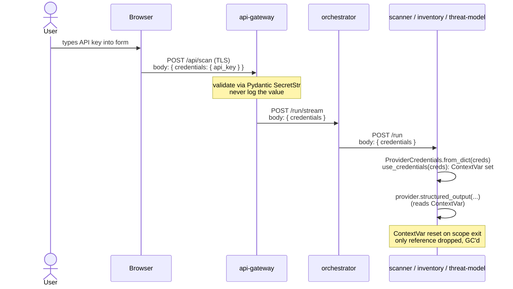
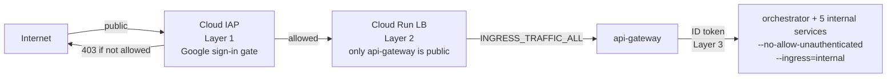

# Security Model

This is the audit doc. It explains the threat model COMPASS was built against, how user credentials are handled, what the attack surface looks like in each deployment mode, and how the defense-in-depth layers actually work.

If you're reporting a vulnerability, see [SECURITY.md](../SECURITY.md) at the repo root for the disclosure process.

---

## Threat model

COMPASS executes scanner tooling and LLM calls against **user-supplied source code** with **user-supplied API keys**. The threat model has three categories:

| Category | What we protect against | What we don't |
|---|---|---|
| **Credential leakage** | API keys ending up on disk, in logs, in error messages, in workspace artifacts, or accessible to other tenants. | A malicious user keylogging their own browser. |
| **Code execution** | An attacker tricking a scanner tool into executing code from a scanned repo (RCE via crafted inputs to Trivy, Bandit, etc.). The scanner runs as an unprivileged container with no outbound network beyond LLM/MCP calls. | A 0-day in a scanner binary with full code-exec capability — same risk as running those tools locally. |
| **Multi-tenant abuse** | One scan affecting another scan's results, leaking data across tenants, or starving the platform via abuse. | Sustained DDoS at the network level. |

Out of scope: protecting against the user themselves (they have full control over their scan input + their own credentials).

---

## Credential handling

The single most load-bearing security property: **LLM API keys are per-request, never persisted, never logged.**

### The flow

### What this guarantees

- **Never on disk.** No `.env`, no temp file, no cache. The single in-memory reference is dropped when the request scope exits ([shared/llm_provider.py:160-174](../shared/llm_provider.py#L160-L174)).
- **Never in logs.** Two layers:
  1. The api-gateway's audit log explicitly excludes the credentials block ([api_gateway/app/main.py:115-124](../api_gateway/app/main.py#L115-L124)).
  2. A logging filter ([api_gateway/app/security.py:43-58](../api_gateway/app/security.py#L43-L58)) regex-scrubs anything matching `sk-ant-*`, `ghp_*`, `github_pat_*` from every log line as a belt-and-braces.
- **Pydantic SecretStr.** The request model uses `SecretStr` ([api_gateway/app/models.py](../api_gateway/app/models.py)) so accidental string interpolation gives `**********` instead of the value.
- **Validated server-side.** Keys must match a tight regex before being forwarded ([validators.py:47-49](../api_gateway/app/validators.py#L47-L49)) — `sk-ant-[A-Za-z0-9_\-]{20,300}` for Claude, 32–64 hex for Azure. Garbage data can't cause weird behavior in downstream HTTP libraries.
- **Allowlisted models.** Claude model names are checked against a fixed list ([validators.py:54-60](../api_gateway/app/validators.py#L54-L60)) so the user can't sneak in a model that doesn't exist or is unreasonably expensive.
- **Bounded scope.** `use_credentials()` uses a Python `ContextVar` that's automatically cleaned up at scope exit. Even if an exception is raised mid-call, the credential reference is reset.

### What it doesn't guarantee

- The LLM provider itself sees the API key — that's by design; it's their credential.
- TLS terminates at the cloud load balancer (cloud) or the user's local network (local Docker). The credential is in cleartext at the application layer.

---

## Input validation

Every external input passes through validators before reaching scan logic:

| Input | Validator | Rejects |
|---|---|---|
| GitHub URL | [validators.py:67-100](../api_gateway/app/validators.py#L67-L100) | SSH URLs (`git@...`), HTTP without S, hosts other than `github.com`, paths with traversal characters. |
| GitHub PAT | [validators.py](../api_gateway/app/validators.py) | Tokens that don't match `ghp_*` / `github_pat_*` patterns. |
| Provider | Pydantic `Literal["azure", "claude"]` | Anything else. |
| Credentials body | Pydantic strict model with `extra="forbid"` | Unknown fields can't sneak through to internal agents. |
| Scan request rate | slowapi | More than **3 scans/minute per IP** ([main.py:106](../api_gateway/app/main.py#L106)). |

### Git clone safety

The repo clone is hardened ([api_gateway/app/github.py](../api_gateway/app/github.py)):
- `--depth 1 --single-branch` — minimal data, no full history.
- PAT injected via `GIT_ASKPASS` helper, never appears in `argv` or process list.
- 500 MB size cap (`COMPASS_MAX_REPO_BYTES`); cloned to a per-job tempdir; deleted on completion.
- 5-minute clone timeout (`COMPASS_CLONE_TIMEOUT_S`).
- Runs in an isolated container with no privileged access.

---

## Attack surface — local Docker

The 8 services bind to `localhost` only via Docker Compose's port mapping. Nothing is exposed to the internet unless you've explicitly opened firewall ports or run behind a proxy.

| Surface | Exposure | Notes |
|---|---|---|
| `frontend` :3000 | localhost | Static SPA. No auth — anyone with localhost access can submit scans, which means they can use your machine as a scanner with their own LLM keys. Acceptable for single-user dev. |
| `api-gateway` :8094 | localhost (proxied via frontend) | Same. |
| Other 6 services | docker network only | Not bound to host. Reachable only by other compose containers. |
| The `compass-workspace` named volume | host filesystem | Per-job clones live here briefly. The api-gateway cleans up on completion. |

If you're going to expose local Docker beyond your machine (don't, but if you must), put it behind a reverse proxy with auth. Better: deploy to GCP and use IAP.

---

## Attack surface — GCP Cloud Run

The cloud architecture has **defense in depth** at three layers, designed so a failure at any one layer doesn't compromise the system:

### Layer 1 — Cloud IAP

Only the configured `owner_email` Google account can reach the api-gateway URL. IAP intercepts requests **before** any container instance is started. Properties:

- A leaked URL costs nothing — IAP returns 403 + Google sign-in redirect, no compute is billed, no instance starts.
- The IAP allowlist is managed in Terraform ([infra/terraform/iap.tf](../infra/terraform/iap.tf)) so adding/removing accessors is a `terraform apply` away.
- IAP cookies are SameSite=Lax by default, which prevents CSRF from third-party sites without us doing anything.

### Layer 2 — Service ingress

The api-gateway has `INGRESS_TRAFFIC_ALL` (with IAP gating it). The other 6 services have `INGRESS_TRAFFIC_INTERNAL_ONLY` — they're not reachable from the public internet at all, period, IAP or not. Only services inside the same project can reach them.

### Layer 3 — Service-to-service auth

Internal services have `--no-allow-unauthenticated`. Callers must attach a Google ID token from their runtime SA, with the audience matching the callee's URL. The token is minted at request time from the metadata server ([shared/cloud_auth.py](../shared/cloud_auth.py)) and cached for ~55 minutes.

The IAM bindings are tight ([infra/terraform/runtime_iam.tf](../infra/terraform/runtime_iam.tf)):
- api-gateway SA → orchestrator SA (only)
- orchestrator SA → scanner / inventory / threat-model SAs
- scanner SA → mitre-mcp SA
- inventory SA → syft-mcp SA

So even if an attacker compromised the api-gateway container, they could only invoke the orchestrator — not the scanner, inventory, or MCPs directly.

### Layer 4 — Workload Identity Federation for deploys

GitHub Actions doesn't have any long-lived GCP credentials. The `deploy.yml` workflow mints a short-lived OIDC token, `google-github-actions/auth@v2` exchanges it for a 1-hour GCP credential. The WIF provider has an `attribute_condition` locked to `RowanVale-Sec/COMPASS` on `refs/heads/master` ([infra/terraform/modules/iam/main.tf:68](../infra/terraform/modules/iam/main.tf#L68)) — a leaked workflow on a fork or a feature branch can't impersonate the deployer.

The deployer SA is **not** in the IAP allowlist by design: a compromised deploy workflow can update Cloud Run revisions and push images, but it cannot curl the live app or exfiltrate scan results.

---

## What's not protected

Honest list of things outside the threat model:

- **Scanner binaries themselves.** If Trivy or Semgrep has an RCE 0-day triggered by a crafted file in a scanned repo, COMPASS doesn't add a layer of protection. Same risk as running those tools on your own laptop. Mitigation: each agent runs in an unprivileged container with limited outbound network.
- **The user's own LLM provider.** Once the API key reaches Anthropic / Azure, COMPASS has no visibility or control.
- **The MITRE / Syft upstream tools.** `mcp_servers/mitre/Dockerfile` clones Montimage's repo at build time. If they're compromised, our scanner gets bad MITRE data. Mitigation: `REPO_VERSION` is pinned in the Dockerfile.
- **GCP control plane.** If your Google account is compromised, IAP/IAM does nothing. Use 2FA + hardware keys.
- **Sustained DDoS.** Rate limiting is per-IP and only on `/api/scan`. A determined attacker with many IPs could rack up Cloud Run cold starts. Cloud Run's billing model bounds the cost (request-based, max-instances=10), but you'd still see the bill. Add Cloud Armor if this matters.

---

## Vulnerability disclosure

See [SECURITY.md](../SECURITY.md) at repo root for current contact + response times. Short version: open a private security advisory on GitHub or email the address listed there. Don't open a public issue with reproduction details.

---

## Where to go next

- [understand-it.md](understand-it.md) — system architecture (credentials flow, request lifecycle)
- [deploy-it.md](deploy-it.md) — how IAP and WIF are configured during deployment
- [contribute.md](contribute.md) — coding conventions for the credential flow
- [reference/api.md](reference/api.md) — exact request/response schemas
- [infra/terraform/runtime_iam.tf](../infra/terraform/runtime_iam.tf) — the IAM binding source of truth
