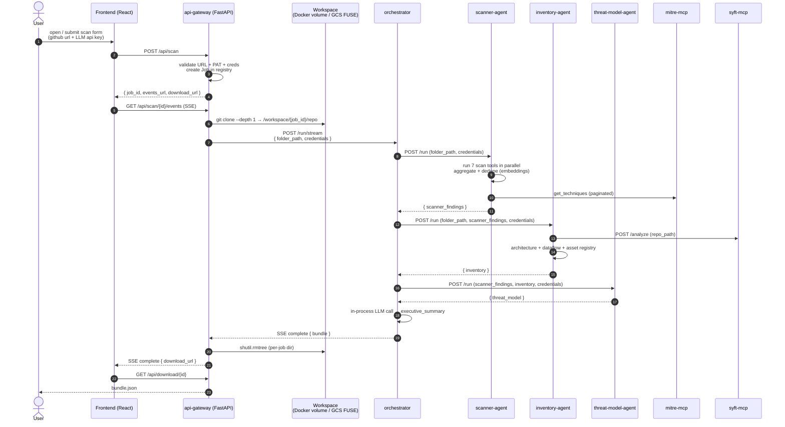
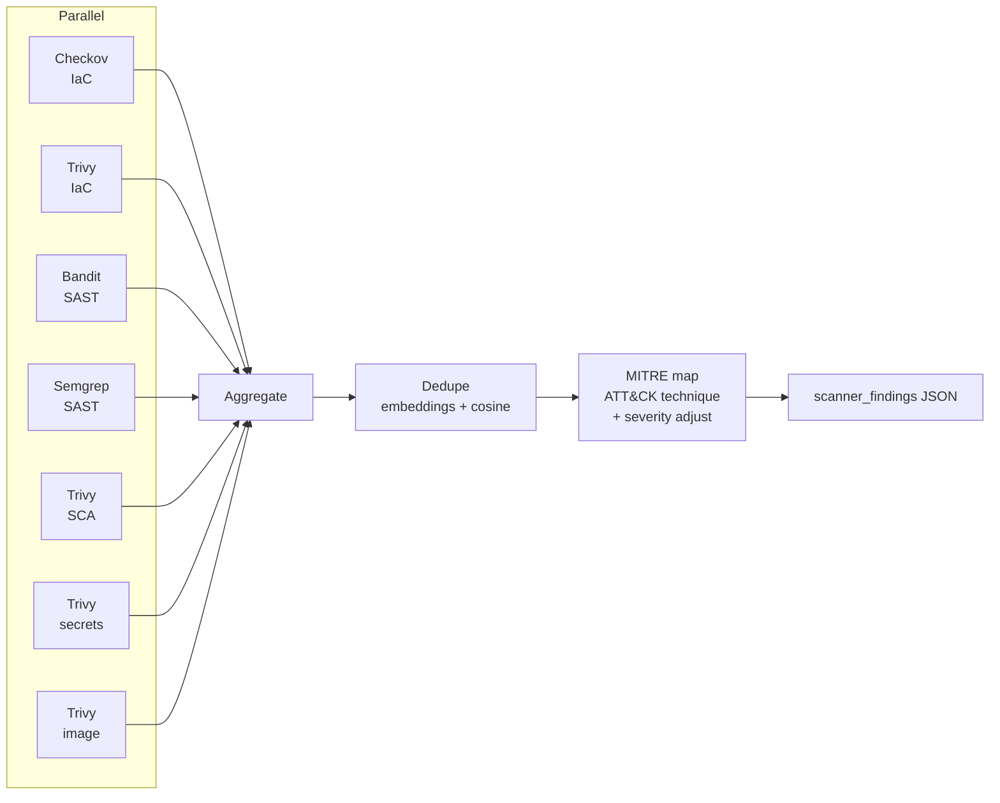
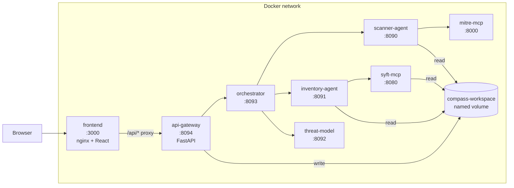
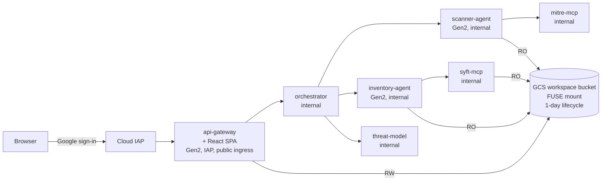

# Understand COMPASS

This is the architecture doc. Read it if you want to know **what runs**, **how a scan flows**, and **why the design choices were made the way they were**. Aimed at architects, learners, and anyone reviewing the system before contributing or deploying.

For getting started: [use-it.md](use-it.md). For deploying: [deploy-it.md](deploy-it.md). For changing the code: [contribute.md](contribute.md). For the security model: [security.md](security.md).

---

## What COMPASS is

A multi-agent pipeline that ingests a Git repository and produces a CISO-ready threat model.

Input: a public GitHub URL (optionally a PAT for private repos) plus an LLM API key.
Output: a JSON bundle containing scanner findings, an asset inventory, a STRIDE threat model, and an executive summary.

The pipeline is request-driven — there's no background processing. A scan starts when the user submits the form, runs for 5–15 minutes, then the system goes idle.

---

## Components

Today the system runs as **8 services in local Docker** and **7 services on GCP Cloud Run** (the cloud build merges the React frontend into the FastAPI api-gateway to live behind a single IAP gate — see [Deployment models](#deployment-models) below).

| Service | Port | Role |
|---|---|---|
| `frontend` | 3000 (local only) | React SPA + nginx that proxies `/api` to the gateway. On cloud, bundled into api-gateway. |
| `api-gateway` | 8094 | FastAPI BFF. Receives `POST /api/scan`, clones the repo, kicks off the orchestrator, streams SSE events to the browser. |
| `orchestrator` | 8093 | Flask service that calls scanner → inventory → threat-model in sequence and runs an in-process LLM call for the executive summary. |
| `scanner-agent` | 8090 | Flask. Runs Trivy / Checkov / Bandit / Semgrep, deduplicates with embeddings, maps each finding to MITRE ATT&CK. |
| `inventory-agent` | 8091 | Flask. SBOM via Syft, architecture detection, data-flow analysis, asset registry. |
| `threat-model-agent` | 8092 | Flask. STRIDE analysis + attack scenarios + risk scoring from scanner + inventory inputs. |
| `mitre-mcp` | 8000 | FastMCP server wrapping Montimage's MITRE ATT&CK dataset. Called via the MCP streamable-HTTP protocol. |
| `syft-mcp` | 8080 | Flask wrapper around the `syft` SBOM binary. Plain HTTP, not MCP. |

Each `*-agent` exposes `POST /run` for the synchronous variant; the orchestrator additionally exposes `POST /run/stream` which emits SSE stage events as it fans out. Health checks at `GET /health` on every service.

---

## How a scan flows

A few details worth calling out:

- **No persistent message bus.** Every payload is passed in HTTP request bodies. The orchestrator holds intermediate results in memory for the duration of one scan. This is why `concurrency=1` on the orchestrator and the agents (see [services.tf](../infra/terraform/services.tf)).
- **The workspace is per-job and ephemeral.** The api-gateway clones into `/workspace/{job_id}/repo`, the agents read from there, the api-gateway deletes the directory in a `finally` block when the job finishes ([api_gateway/app/main.py:203-209](../api_gateway/app/main.py#L203-L209)).
- **SSE all the way through.** The orchestrator writes `{"event": "stage", "data": {...}}` events as each stage starts and finishes; the api-gateway forwards them onto the browser's EventSource. The browser sees real-time progress; the final event is `complete` with the full bundle inline.
- **Credentials never touch disk.** The user's LLM API key arrives in the POST body as a `SecretStr`, gets validated, gets forwarded into each agent's request body, gets scoped into a Python `ContextVar` for the duration of one call, then the reference is dropped. No `.env`, no logs, no S3 cache. See [security.md](security.md) for details.

---

## Pipeline stages in detail

### Scanner agent

Runs **seven tools in parallel** over the cloned workspace, then runs three sequential stages over the raw findings:

1. **Aggregate** — normalises every tool's native JSON into a unified `findings` schema.
2. **Deduplicate** — uses local sentence-transformer embeddings + cosine similarity to collapse near-duplicates ([deduplicator.py](../agents/scanner/pipeline/deduplicator.py)). The embedding model is pre-pulled at build time so the first scan doesn't pay an 80 MB download.
3. **MITRE map** — fetches the entire ATT&CK Enterprise technique catalog from `mitre-mcp` once, then for each finding does a Python token-overlap shortlist + one LLM call to pick the best technique and adjust severity. 15-way parallelism.

### Inventory agent

Pure Python sequential pipeline (no LLM-as-orchestrator — earlier versions tried that and the LLM truncated multi-KB JSON between steps; see [inventory_agent.py:73-82](../agents/inventory/inventory_agent.py#L73-L82)):

1. **SBOM** via the Syft MCP server (cross-references with the scanner's SCA findings if provided).
2. **Architecture analysis** — detects services, frameworks, IaC, cloud resources from the codebase (LLM-assisted).
3. **Data flow analysis** — entry points, trust boundaries, data stores (consumes architecture).
4. **Asset registry** — consolidates all of the above into one schema with risk classifications.

### Threat model agent

Consumes scanner + inventory JSON in its request body — does not read the workspace. Runs a 4-stage pipeline:

1. Correlate vulnerabilities with architecture components.
2. Generate attack scenarios from chained findings + MITRE techniques.
3. STRIDE analysis (Spoofing, Tampering, Repudiation, Info Disclosure, DoS, Elevation of Privilege).
4. Score and prioritize risks (CVSS-style + business impact).

### Executive summary

Runs in-process inside the orchestrator. One LLM call that summarizes the scanner + inventory + threat-model results into a 2–3 paragraph CISO-facing report with a risk posture, top-3 actions, and key metrics. Schema-validated (`structured_output`) so it can't drift.

---

## Deployment models

### Local (Docker Compose) — 8 services

The shared `compass-workspace` Docker volume is the workspace handoff mechanism.

### GCP Cloud Run — 7 services + IAP

The cloud build collapses `frontend` into `api-gateway` (FastAPI serves the React build at `/` via [Dockerfile.cloud](../api_gateway/Dockerfile.cloud)) so a single Cloud IAP gate covers the public surface — cross-origin fetches don't survive an IAP redirect.

Key cloud properties:
- **Scale to zero.** Every service has `min_instance_count=0`, request-based billing. Idle stack costs ~$1–3/mo (Artifact Registry image storage). Active scan compute fits inside the free tier most months.
- **Internal services use `--no-allow-unauthenticated`** and require a Google ID token from the calling service's runtime SA. Token minting is handled by [shared/cloud_auth.py](../shared/cloud_auth.py); each caller's request includes `Authorization: Bearer <id_token>` only when running on Cloud Run (the helper returns `None` locally so docker-compose paths are unchanged).
- **The api-gateway sits behind Cloud IAP.** Only the configured `owner_email` Google account can reach it. Anyone else gets a 403 from IAP **before** any container instance starts — so a leaked URL costs nothing and can't be abused.
- **Workspace handoff via Cloud Storage FUSE.** The 4 services that touch the workspace (api-gateway RW; scanner / inventory / syft-mcp RO) mount the same GCS bucket at `/workspace`. The application code is unchanged from the local Docker path because the env-var contract (`COMPASS_WORKSPACE_ROOT`, `SCAN_FOLDER_PATH`) is the same.
- **Session affinity on api-gateway** so the SSE stream lands on the same instance that owns the in-memory `JobRegistry` entry for that `job_id` ([jobs.py](../api_gateway/app/jobs.py)).

For the actual deploy mechanics, see [deploy-it.md](deploy-it.md) and [infra/README.md](../infra/README.md).

---

## Why these design choices

Things that look weird in the code, with the reason:

- **Per-request LLM credentials, not env-config.** Multi-tenant from day one — the user supplies their own API key per scan. This means the platform doesn't pay LLM bills, doesn't have to rotate keys, and can't accidentally log them. Cost: every internal HTTP body carries the secret, which is why all logging goes through [shared/security.py](../shared/security.py) scrubbing.
- **No persistent message bus.** A scan is one request from the browser's POV. The orchestrator coordinates fan-out in memory. No Kafka, no S3, no Redis. This is fine because the workload is request-driven and scans never need to survive a restart.
- **Concurrency=1 on the agents.** Each scan owns the worker thread end-to-end ([orchestrator_agent.py:354](../agents/orchestrator/orchestrator_agent.py#L354)). Cheaper than building thread-safe shared state, and Cloud Run scales horizontally so 10 concurrent scans = 10 instances.
- **Inventory pipeline is hand-coded, not LLM-orchestrated.** Earlier versions had the LLM chain the four inventory tools. The LLM kept truncating multi-KB JSON to `{}` between steps. Switching to deterministic Python orchestration with LLM calls *inside* each tool fixed it.
- **`mitre-mcp` URL is read from env, not LLM-decided.** LLMs hallucinate plausible-looking URLs when given the option ([mitre_mapper.py:218-223](../agents/scanner/pipeline/mitre_mapper.py#L218-L223)).
- **Frontend bundled into api-gateway on cloud, separate on local.** Local dev keeps the standalone nginx for hot reload. Cloud merges them so a single IAP gate covers everything; otherwise the SPA's cross-origin `fetch` to api-gateway would hit IAP's redirect-to-Google-login flow, which `fetch()` can't follow.

---

## Where this is heading

The current 4-agent design is what's built and shipping. A more ambitious 5-agent design ([Code Intake / Semantic Classification / Data Flow Tracing / Architecture Synthesis / Threat Modeling](future/threat-modeling-agent-framework.md)) is sketched in `docs/future/` as a forward-looking exploration — a proper knowledge graph backing the architecture extraction, with each stage as its own agent that can be iterated independently. Not built today; treat it as design thinking, not a roadmap.
